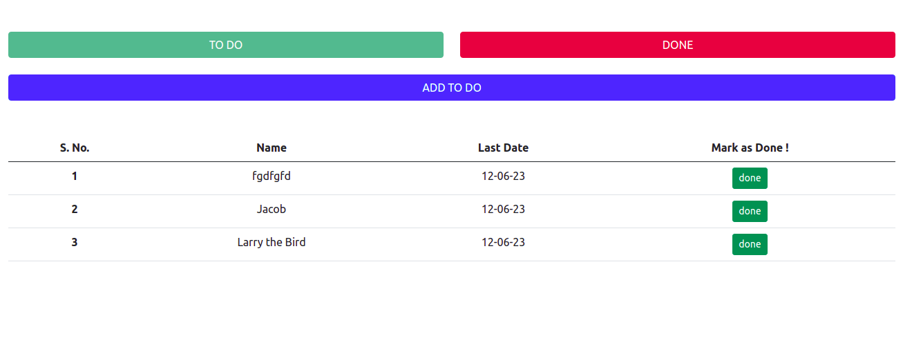
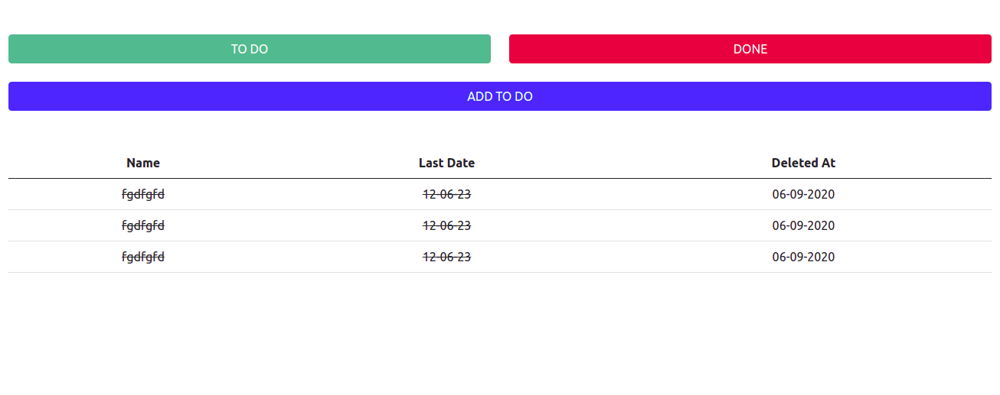
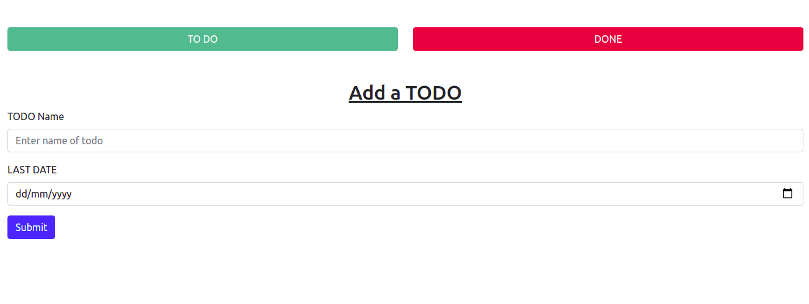

<h3 align="center">TODO HTML TEMPLATE</h3>

---

<div align="center">

[](https://github.com/novicexp/todo-html-template)

 

</div>

---

## 📝 Table of Contents

- [About](#about)
- [Getting Started](#getting_started)
- [Screenshots](#screenshots)

## 🧐 About <a name = "about"></a>

A simple todo ui template in `html` and `bootstrap`

## 🏁 Getting Started <a name = "getting_started"></a>

- clone project
  ```
  git clone https://github.com/novicexp/todo-html-template
  ```
  ```
  cd todo-html-template/
  ```

- `open file in browser`

---

## Screenshots <a name = "screenshots"></a>

- Todo List UI

<p align="center">

</p>

- Deleted Todo List UI

<p align="center">

</p>

- Add Todo List UI

<p align="center">

</p>

---

<p align="center">
Thanks :)
</p>